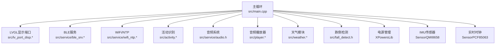
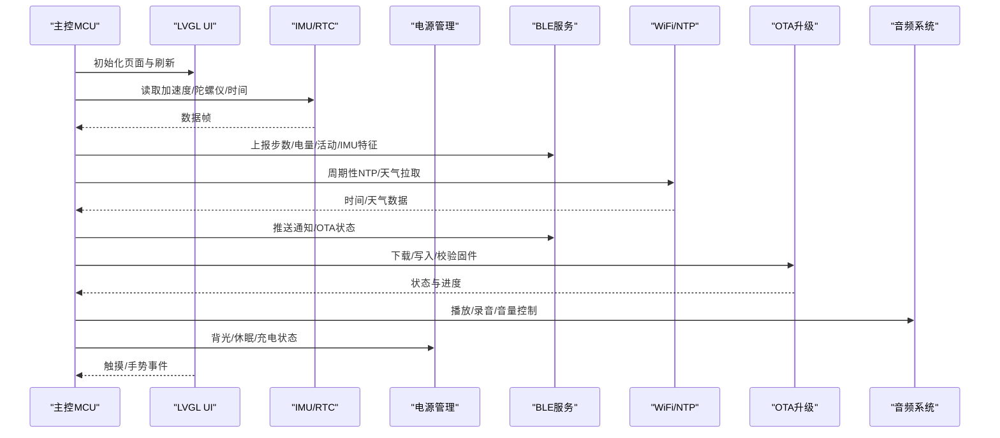
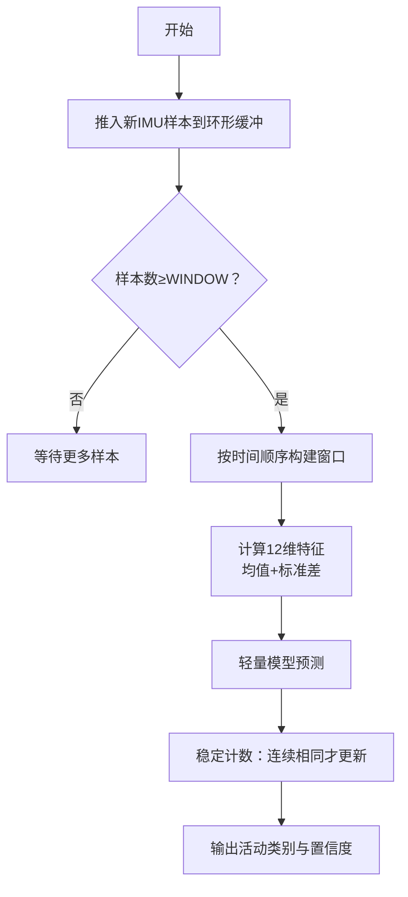
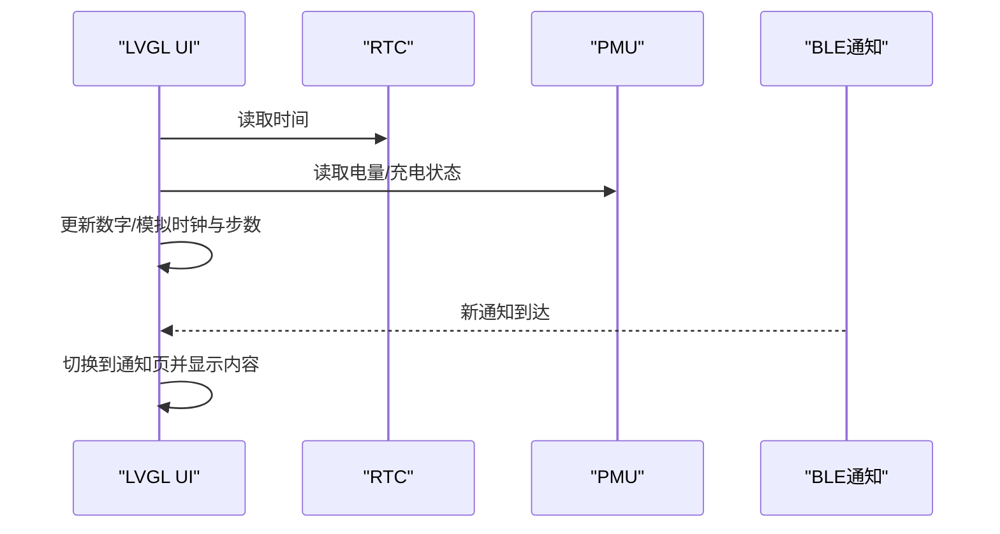
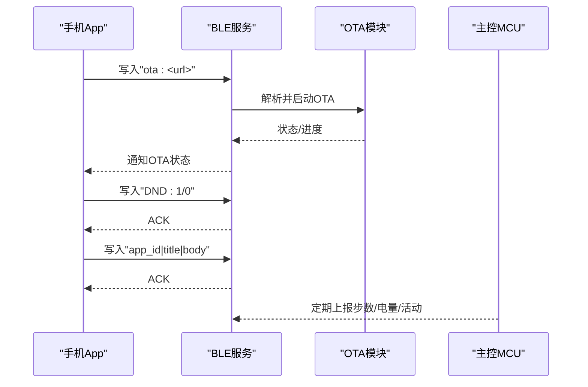
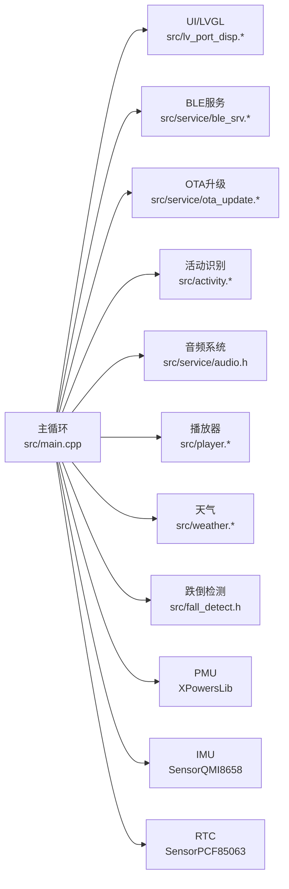

# 系统特性

<cite>
**本文引用的文件**
- [src/main.cpp](file://src/main.cpp)
- [src/activity.h](file://src/activity.h)
- [src/activity.cpp](file://src/activity.cpp)
- [src/lv_port_disp.h](file://src/lv_port_disp.h)
- [src/lv_port_disp.cpp](file://src/lv_port_disp.cpp)
- [src/service/ble_srv.h](file://src/service/ble_srv.h)
- [src/service/ble_srv.cpp](file://src/service/ble_srv.cpp)
- [src/service/ota_update.h](file://src/service/ota_update.h)
- [src/service/ota_update.cpp](file://src/service/ota_update.cpp)
- [src/service/audio.h](file://src/service/audio.h)
- [src/player.h](file://src/player.h)
- [src/player.cpp](file://src/player.cpp)
- [src/weather.h](file://src/weather.h)
- [src/weather.cpp](file://src/weather.cpp)
- [src/fall_detect.h](file://src/fall_detect.h)
</cite>

## 目录
1. [引言](#引言)
2. [项目结构](#项目结构)
3. [核心组件](#核心组件)
4. [架构总览](#架构总览)
5. [详细组件分析](#详细组件分析)
6. [依赖关系分析](#依赖关系分析)
7. [性能考虑](#性能考虑)
8. [故障排查指南](#故障排查指南)
9. [结论](#结论)

## 引言
本文件面向SmartBracelet智能手环项目的系统特性说明，围绕以下能力展开：实时活动识别（步行、跑步、静止）、多页面显示系统（数字时钟、模拟时钟、传感器监控、通知展示等）、BLE通信服务（通知推送、OTA升级、数据同步）、AI边缘推理系统、音频处理系统、电源管理系统。文档从功能描述、技术实现原理、使用场景与优势分析入手，并给出特性间的关联与协同机制，帮助开发者快速理解与使用。

## 项目结构
项目采用“硬件抽象层 + 外设驱动 + 业务服务 + UI界面”的分层组织方式：
- 硬件抽象与显示：LVGL端口适配、屏幕驱动、触摸输入
- 传感器与电源：RTC、IMU、电源管理单元
- 业务服务：BLE服务、OTA升级、音频播放/录音、天气获取、语音聊天
- 应用UI：多页面切换、时钟/步数/电量/通知等状态展示

图表来源
- [src/main.cpp](file://src/main.cpp#L615-L722)
- [src/lv_port_disp.cpp](file://src/lv_port_disp.cpp#L22-L32)
- [src/service/ble_srv.cpp](file://src/service/ble_srv.cpp#L250-L285)
- [src/activity.cpp](file://src/activity.cpp#L78-L130)
- [src/player.cpp](file://src/player.cpp#L82-L148)
- [src/weather.cpp](file://src/weather.cpp#L81-L116)
- [src/fall_detect.h](file://src/fall_detect.h#L16-L31)

章节来源
- [src/main.cpp](file://src/main.cpp#L615-L722)

## 核心组件
- 实时活动识别：基于滑动窗口统计特征，使用轻量级分类器进行边缘推理，输出当前活动类别与特征供BLE上传或AI协同
- 多页面显示系统：数字时钟、模拟时钟、传感器页、通知页、计时器、天气、活动页、音乐控制、语音聊天、播放器
- BLE通信服务：设备信息、电池、时间、通知、数据服务（步数、电量、活动、IMU特征）、OTA服务、Do Not Disturb模式
- AI边缘推理系统：滑动窗提取均值/标准差特征，配合手机端进行协同推理
- 音频处理系统：I2S音频播放（ES8311）、录音（INMP441），支持WAV播放与音量控制
- 电源管理系统：PMU配置、电量估算、充电状态、背光控制、深度睡眠策略

章节来源
- [src/activity.h](file://src/activity.h#L4-L13)
- [src/activity.cpp](file://src/activity.cpp#L42-L76)
- [src/service/ble_srv.h](file://src/service/ble_srv.h#L6-L49)
- [src/service/ble_srv.cpp](file://src/service/ble_srv.cpp#L189-L223)
- [src/service/audio.h](file://src/service/audio.h#L4-L23)
- [src/player.cpp](file://src/player.cpp#L82-L148)
- [src/weather.cpp](file://src/weather.cpp#L81-L116)

## 架构总览
下图展示了系统在主循环中的关键协作流程：传感器采样与UI更新、BLE数据上报、OTA状态反馈、WiFi省电策略、音频与TF卡播放、天气与通知处理。

图表来源
- [src/main.cpp](file://src/main.cpp#L724-L800)
- [src/service/ble_srv.cpp](file://src/service/ble_srv.cpp#L317-L370)
- [src/service/ota_update.cpp](file://src/service/ota_update.cpp#L54-L171)
- [src/weather.cpp](file://src/weather.cpp#L118-L146)

## 详细组件分析

### 实时活动识别（步行/跑步/静止）
- 功能描述
  - 通过滑动窗口（长度与步长）收集IMU原始数据，计算12维特征（均值+标准差），稳定预测当前活动类别
  - 支持将最新特征通过BLE服务上报，便于手机端进行协同推理
- 技术实现原理
  - 环形缓冲区存储WINDOW长度样本，按STRIDE步进提取窗口
  - 计算每通道均值与标准差，拼接为特征向量
  - 使用轻量模型进行分类，要求连续多次一致才稳定输出
- 使用场景与优势
  - 运动监测、健康追踪、运动模式识别
  - 边缘推理降低云端依赖，BLE上报特征用于进一步分析
- 关键接口与路径
  - 特征提取与预测：[src/activity.cpp](file://src/activity.cpp#L42-L76)
  - 页面展示与标签更新：[src/activity.cpp](file://src/activity.cpp#L78-L130)
  - 对外接口声明：[src/activity.h](file://src/activity.h#L4-L13)
- 协同机制
  - 主循环周期性调用活动更新，BLE服务在连接时通知步数/活动/IMU特征

图表来源
- [src/activity.cpp](file://src/activity.cpp#L30-L76)
- [src/activity.cpp](file://src/activity.cpp#L107-L130)

章节来源
- [src/activity.h](file://src/activity.h#L4-L13)
- [src/activity.cpp](file://src/activity.cpp#L42-L76)
- [src/activity.cpp](file://src/activity.cpp#L107-L130)

### 多页面显示系统（数字/模拟时钟、传感器监控、通知等）
- 功能描述
  - 数字时钟与日期、步数统计、电量与充电状态、电池条
  - 模拟时钟表盘与指针
  - 传感器页：加速度、角速度、电池电压
  - 通知页：应用名、标题、正文
  - 计时器、天气、活动页、音乐控制、语音聊天、播放器
- 技术实现原理
  - LVGL渲染与双缓冲，显示驱动桥接到Arduino_GFX
  - 页面对象在初始化时创建，主循环中按需刷新
  - 手势/点击事件绑定到页面按钮回调
- 使用场景与优势
  - 丰富的本地可视化界面，减少对手机依赖
  - 分页设计提升信息密度与交互效率
- 关键接口与路径
  - 显示端口初始化：[src/lv_port_disp.cpp](file://src/lv_port_disp.cpp#L22-L32)
  - 页面创建与切换：[src/main.cpp](file://src/main.cpp#L406-L419)
  - 数字/模拟时钟刷新：[src/main.cpp](file://src/main.cpp#L457-L508), [src/main.cpp](file://src/main.cpp#L276-L287)
  - 传感器页刷新：[src/main.cpp](file://src/main.cpp#L435-L446)
  - 通知页刷新：[src/main.cpp](file://src/main.cpp#L313-L319), [src/service/ble_srv.cpp](file://src/service/ble_srv.cpp#L102-L122)

图表来源
- [src/main.cpp](file://src/main.cpp#L457-L508)
- [src/main.cpp](file://src/main.cpp#L276-L287)
- [src/main.cpp](file://src/main.cpp#L313-L319)
- [src/service/ble_srv.cpp](file://src/service/ble_srv.cpp#L102-L122)

章节来源
- [src/lv_port_disp.cpp](file://src/lv_port_disp.cpp#L22-L32)
- [src/main.cpp](file://src/main.cpp#L406-L419)
- [src/main.cpp](file://src/main.cpp#L457-L508)
- [src/main.cpp](file://src/main.cpp#L276-L287)
- [src/main.cpp](file://src/main.cpp#L435-L446)
- [src/main.cpp](file://src/main.cpp#L313-L319)

### BLE通信服务（通知推送、OTA升级、数据同步）
- 功能描述
  - 设备信息服务、电池服务、当前时间服务
  - 通知服务：接收手机推送的通知并转存到本地结构体
  - 数据服务：步数、原始电量、活动状态、IMU特征
  - OTA服务：手机下发升级URL触发下载/写入/校验
  - Do Not Disturb模式：抑制通知显示
- 技术实现原理
  - 使用BLEDevice/BLEServer建立GATT服务与特征
  - onWrite回调解析协议字符串，触发相应动作
  - OTA状态机在主循环中推进下载/写入/校验阶段
- 使用场景与优势
  - 低功耗广告间隔、MTU优化传输
  - 通过BLE实现与手机的双向数据通道
- 关键接口与路径
  - 服务初始化与广告：[src/service/ble_srv.cpp](file://src/service/ble_srv.cpp#L250-L285)
  - 通知接收与解析：[src/service/ble_srv.cpp](file://src/service/ble_srv.cpp#L63-L123)
  - 数据服务上报：[src/service/ble_srv.cpp](file://src/service/ble_srv.cpp#L330-L361), [src/service/ble_srv.cpp](file://src/service/ble_srv.cpp#L403-L412)
  - OTA控制与状态：[src/service/ble_srv.cpp](file://src/service/ble_srv.cpp#L225-L248), [src/service/ble_srv.cpp](file://src/service/ble_srv.cpp#L377-L385)
  - 主循环OTA状态上报：[src/main.cpp](file://src/main.cpp#L729-L741)

图表来源
- [src/service/ble_srv.cpp](file://src/service/ble_srv.cpp#L82-L92)
- [src/service/ble_srv.cpp](file://src/service/ble_srv.cpp#L225-L248)
- [src/service/ble_srv.cpp](file://src/service/ble_srv.cpp#L377-L385)
- [src/service/ble_srv.cpp](file://src/service/ble_srv.cpp#L102-L122)
- [src/main.cpp](file://src/main.cpp#L729-L741)

章节来源
- [src/service/ble_srv.h](file://src/service/ble_srv.h#L6-L49)
- [src/service/ble_srv.cpp](file://src/service/ble_srv.cpp#L250-L285)
- [src/service/ble_srv.cpp](file://src/service/ble_srv.cpp#L330-L361)
- [src/service/ble_srv.cpp](file://src/service/ble_srv.cpp#L403-L412)
- [src/service/ble_srv.cpp](file://src/service/ble_srv.cpp#L82-L92)
- [src/service/ble_srv.cpp](file://src/service/ble_srv.cpp#L102-L122)
- [src/main.cpp](file://src/main.cpp#L729-L741)

### AI边缘推理系统
- 功能描述
  - 在设备侧完成特征抽取与分类，BLE可上传特征以供手机端协同推理
- 技术实现原理
  - 滑动窗统计特征（均值+标准差），轻量模型预测类别
  - 特征数组保存以便BLE通知
- 使用场景与优势
  - 低延迟、隐私保护、减少云端依赖
- 关键接口与路径
  - 特征生成与预测：[src/activity.cpp](file://src/activity.cpp#L42-L76)
  - 特征导出与BLE上报：[src/activity.cpp](file://src/activity.cpp#L23-L28), [src/service/ble_srv.cpp](file://src/service/ble_srv.cpp#L403-L412)

章节来源
- [src/activity.cpp](file://src/activity.cpp#L42-L76)
- [src/activity.cpp](file://src/activity.cpp#L23-L28)
- [src/service/ble_srv.cpp](file://src/service/ble_srv.cpp#L403-L412)

### 音频处理系统（播放/录音/音量）
- 功能描述
  - I2S音频播放（ES8311）、录音（INMP441），WAV播放与音量控制
  - 播放器UI：扫描TF卡文件、选择与播放
- 技术实现原理
  - 音频初始化、播放/停止、录音启动/停止、采样率与位深配置
  - 播放器页面维护文件列表、状态与按钮事件
- 使用场景与优势
  - 本地音频播放、语音聊天回放、录音转写
- 关键接口与路径
  - 音频接口声明：[src/service/audio.h](file://src/service/audio.h#L4-L23)
  - 播放器UI与逻辑：[src/player.cpp](file://src/player.cpp#L82-L156)

章节来源
- [src/service/audio.h](file://src/service/audio.h#L4-L23)
- [src/player.cpp](file://src/player.cpp#L82-L156)

### 电源管理系统
- 功能描述
  - PMU配置、电量估算、充电状态、背光控制、深度睡眠
- 技术实现原理
  - 初始化PMU，设置输出电压与使能项；读取ADC原始寄存器估算电量；根据状态更新UI与BLE
  - 屏幕超时与手腕抬腕唤醒；WiFi周期性开关以节能
- 使用场景与优势
  - 延长续航、降低功耗、智能休眠
- 关键接口与路径
  - PMU初始化与配置：[src/main.cpp](file://src/main.cpp#L670-L716)
  - 电量更新与UI联动：[src/main.cpp](file://src/main.cpp#L469-L500)
  - 背光与超时控制：[src/main.cpp](file://src/main.cpp#L549-L557), [src/main.cpp](file://src/main.cpp#L95-L99)

章节来源
- [src/main.cpp](file://src/main.cpp#L670-L716)
- [src/main.cpp](file://src/main.cpp#L469-L500)
- [src/main.cpp](file://src/main.cpp#L549-L557)
- [src/main.cpp](file://src/main.cpp#L95-L99)

### 跌倒检测（可选特性）
- 功能描述
  - 基于加速度的自由落体与冲击检测，进入确认态后发送告警
- 技术实现原理
  - 状态机：监控→自由落体→冲击→不动→确认→已发送
- 使用场景与优势
  - 老年人安全监护、运动意外防护
- 关键接口与路径
  - 状态机定义与接口：[src/fall_detect.h](file://src/fall_detect.h#L7-L29)

章节来源
- [src/fall_detect.h](file://src/fall_detect.h#L7-L29)

## 依赖关系分析
- 组件耦合
  - 主循环集中调度UI、BLE、OTA、网络、音频、传感器与电源
  - 活动识别与BLE数据服务存在弱耦合：前者产生数据，后者负责上报
  - 播放器依赖TF卡与音频模块；天气依赖WiFi与JSON解析
- 外部依赖
  - BLE库、HTTPClient、Update、ArduinoJson、LVGL、Arduino_GFX、XPowersLib、SensorLib

图表来源
- [src/main.cpp](file://src/main.cpp#L615-L722)
- [src/service/ble_srv.cpp](file://src/service/ble_srv.cpp#L250-L285)
- [src/service/ota_update.cpp](file://src/service/ota_update.cpp#L18-L40)
- [src/activity.cpp](file://src/activity.cpp#L78-L130)
- [src/player.cpp](file://src/player.cpp#L82-L148)
- [src/weather.cpp](file://src/weather.cpp#L39-L79)
- [src/fall_detect.h](file://src/fall_detect.h#L16-L31)

章节来源
- [src/main.cpp](file://src/main.cpp#L615-L722)

## 性能考虑
- 显示与渲染
  - 双缓冲与flush回调减少重绘开销；合理设置MTU与广告间隔降低BLE功耗
- 传感器与算法
  - 低通/高通滤波与自适应基线提升步数计数稳定性；滑动窗长度与步长平衡实时性与准确性
- 无线与存储
  - WiFi周期性开关与OTA写入分块传输，避免长时间占用射频与Flash写入压力
- 电源管理
  - 屏幕背光按需点亮、深度睡眠、充电状态指示，结合BLE DND模式减少唤醒

## 故障排查指南
- BLE无法连接/OTA失败
  - 检查WiFi是否已连接再发起OTA
  - 查看OTA错误信息与状态机推进
- 通知不显示
  - 确认BLE连接状态与Do Not Disturb模式
- 电量显示异常
  - 检查PMU寄存器读数范围与有效性判断
- 音频播放失败
  - 确认TF卡可用与WAV文件路径正确，检查音频初始化与播放状态

章节来源
- [src/service/ota_update.cpp](file://src/service/ota_update.cpp#L18-L40)
- [src/service/ota_update.cpp](file://src/service/ota_update.cpp#L79-L93)
- [src/service/ble_srv.cpp](file://src/service/ble_srv.cpp#L372-L375)
- [src/service/ble_srv.cpp](file://src/service/ble_srv.cpp#L392-L401)
- [src/main.cpp](file://src/main.cpp#L430-L433)
- [src/player.cpp](file://src/player.cpp#L138-L147)
- [src/service/audio.h](file://src/service/audio.h#L4-L23)

## 结论
SmartBracelet通过清晰的分层架构与模块化设计，在有限资源下实现了从感知、推理、通信到显示与电源管理的完整闭环。各特性之间通过主循环与BLE服务形成松耦合协同，既保证了用户体验，也兼顾了功耗与可靠性。开发者可基于现有接口扩展新功能或优化既有算法，持续提升系统能力。