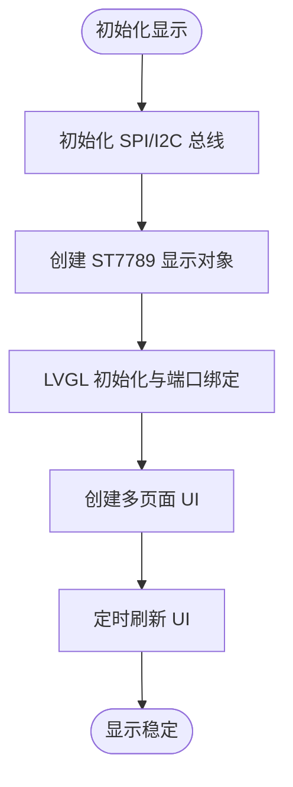
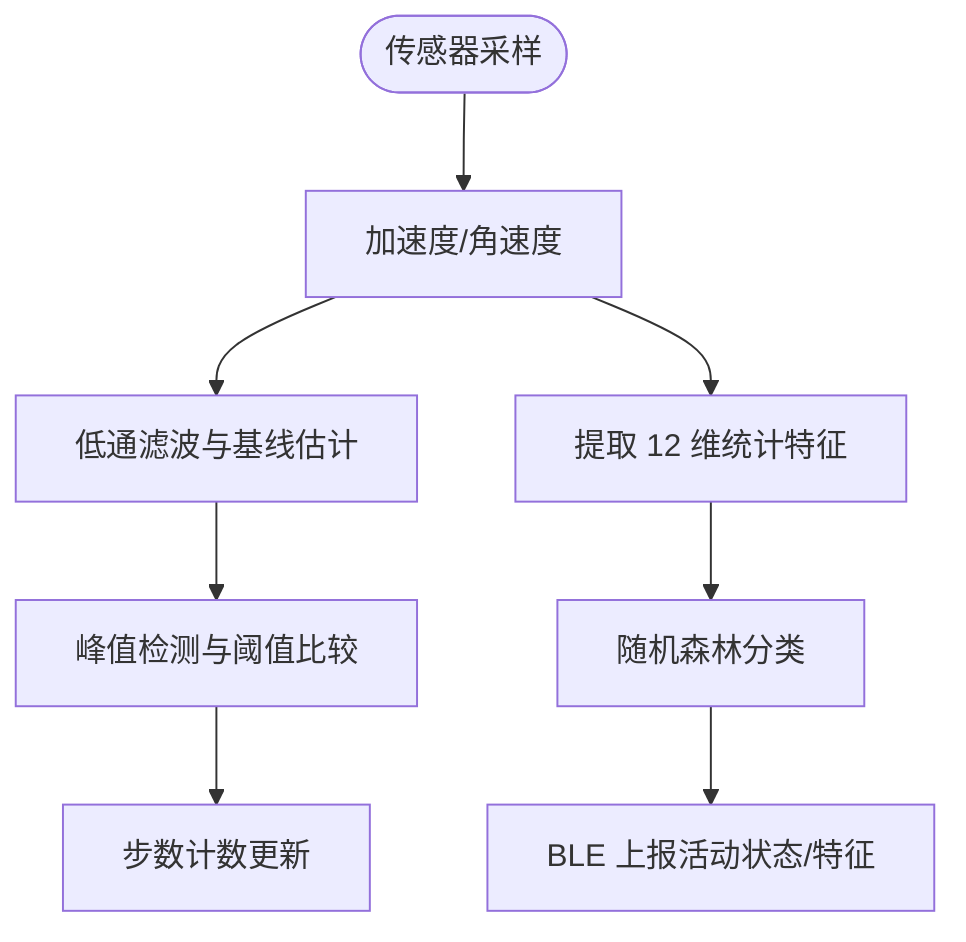
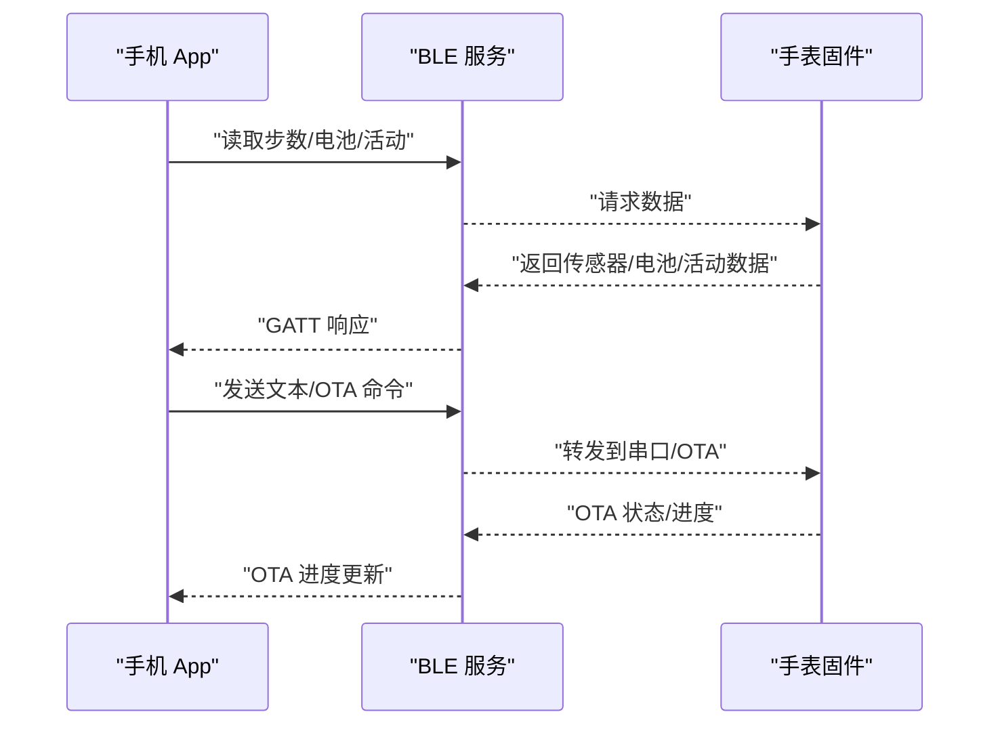
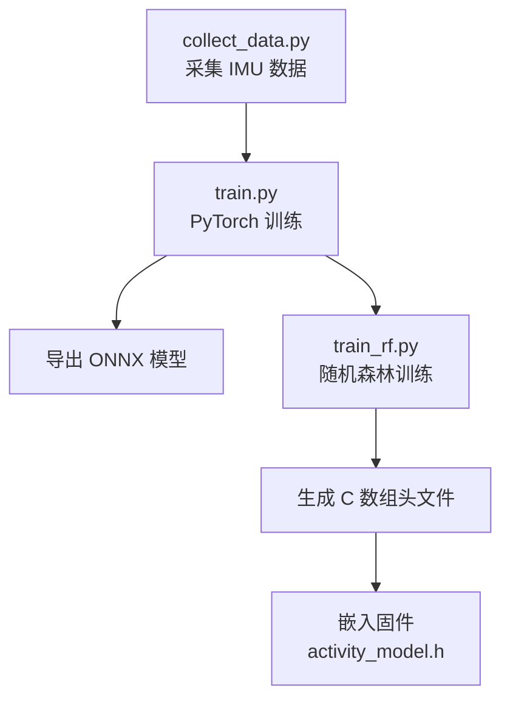
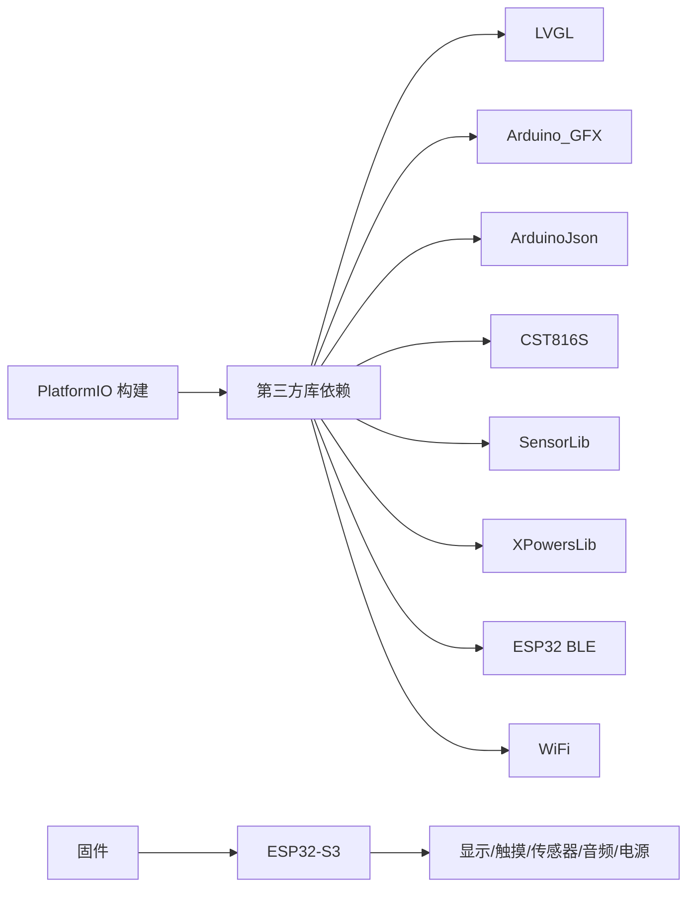

# 项目介绍

<cite>
**本文档引用的文件**
- [platformio.ini](file://platformio.ini)
- [main.cpp](file://src/main.cpp)
- [pin_config.h](file://include/pin_config.h)
- [lv_conf.h](file://include/lv_conf.h)
- [activity.h](file://src/activity.h)
- [weather.h](file://src/weather.h)
- [ble_srv.h](file://src/service/ble_srv.h)
- [wifi_ntp.h](file://src/service/wifi_ntp.h)
- [ESP32-S3-R8-OPI.json](file://boards/ESP32-S3-R8-OPI.json)
- [model.py](file://training/model.py)
- [train.py](file://training/train.py)
- [fall_detect.h](file://src/fall_detect.h)
- [player.h](file://src/player.h)
- [DEVELOPMENT_PLAN.md](file://DEVELOPMENT_PLAN.md)
</cite>

## 目录
1. [引言](#引言)
2. [项目结构](#项目结构)
3. [核心组件](#核心组件)
4. [架构总览](#架构总览)
5. [详细组件分析](#详细组件分析)
6. [依赖关系分析](#依赖关系分析)
7. [性能考量](#性能考量)
8. [故障排查指南](#故障排查指南)
9. [结论](#结论)
10. [附录](#附录)

## 引言
SmartBracelet 是一款基于 Waveshare ESP32-S3-Touch-LCD-1.83 开发板的智能手环项目，采用“手表端侧推理 + 手机端推理”的分布式边缘 AI 架构，结合 LVGL 用户界面、BLE 与 WiFi 通信、多传感器融合与显示系统，提供健康监测、通知同步、天气显示、音频播放、活动识别与跌倒检测等核心功能。项目旨在以较低成本实现高价值的智能穿戴体验，并通过手机 App 与手表形成协同，扩展 AI 推理能力与数据看板。

## 项目结构
项目采用模块化组织，分为嵌入式固件、训练管线与移动端 App 三大部分：
- 嵌入式固件（ESP32-S3）：主程序入口、UI 层、服务层（BLE/WiFi/IMU/PMU/TF 卡/音频）、硬件抽象层（HAL）
- 训练管线（Python）：数据采集、模型训练（PyTorch/随机森林）、导出到嵌入式
- 移动端 App（Flutter）：BLE 通信、数据看板、OTA 管理、AI 协同推理

```mermaid
graph TB
subgraph "嵌入式固件"
MCU["ESP32-S3<br/>主控"]
UI["LVGL UI 层"]
SVC["服务层<br/>BLE/WiFi/IMU/PMU/TF卡/Audio"]
HAL["硬件抽象层<br/>ST7789/CST816S/QMI8658/AXP2101/I2S"]
end
subgraph "训练管线"
PY["Python 训练脚本"]
DATA["数据采集/标注"]
MODEL["模型导出<br/>C 数组/ONNX"]
end
subgraph "移动端 App"
AND["Android App"]
IOS["iOS App"]
BLE["BLE 通信"]
AI["手机端 AI 推理"]
end
MCU --> UI
MCU --> SVC
SVC --> HAL
PY --> DATA --> MODEL --> MCU
AND --> BLE --> MCU
IOS --> BLE --> MCU
AI <-- BLE <-- MCU
```

**图表来源**
- [DEVELOPMENT_PLAN.md](file://DEVELOPMENT_PLAN.md#L221-L261)
- [main.cpp](file://src/main.cpp#L615-L722)
- [train.py](file://training/train.py#L1-L175)

**章节来源**
- [DEVELOPMENT_PLAN.md](file://DEVELOPMENT_PLAN.md#L277-L315)

## 核心组件
- 主控芯片与开发环境：ESP32-S3（双核 240MHz、16MB Flash、8MB OPI PSRAM），PlatformIO + Arduino 框架
- 显示系统：ST7789 240×284 触摸屏 + Arduino_GFX + LVGL 8.4.0
- 交互与输入：CST816S 电容触摸 + LVGL 输入端口
- 传感器与电源：QMI8658 6 轴 IMU + PCF85063 RTC + AXP2101 PMU
- 通信：BLE（GATT 自定义服务）+ WiFi（NTP 校时）
- 存储与音频：TF 卡（SDMMC 1-bit）+ ES8311 音频编解码器（I2S）
- 边缘 AI：随机森林活动识别（手表端）+ 手机端 ONNX 推理（可选）

**章节来源**
- [DEVELOPMENT_PLAN.md](file://DEVELOPMENT_PLAN.md#L69-L111)
- [platformio.ini](file://platformio.ini#L14-L41)
- [main.cpp](file://src/main.cpp#L615-L722)
- [pin_config.h](file://include/pin_config.h#L1-L41)
- [lv_conf.h](file://include/lv_conf.h#L1-L114)

## 架构总览
系统采用“手表端 + 手机端”协同架构：
- 手表端负责实时传感器处理、UI 呈现、BLE/WiFi 通信与本地 AI 推理
- 手机端负责大数据量 AI 推理、数据持久化与可视化、OTA 管理
- 两者通过 BLE GATT 特征值进行数据交换，实现低延迟交互与长周期分析

```mermaid
graph TB
subgraph "手表端"
FW["固件主循环<br/>main.cpp"]
UI["LVGL UI<br/>多页面/手势"]
BLE["BLE 服务<br/>通知/OTA/HID"]
WIFI["WiFi NTP 校时"]
IMU["IMU/QMI8658"]
RTC["RTC/PCF85063"]
PMU["PMU/AXP2101"]
TF["TF 卡/SDMMC"]
AUD["音频/ES8311"]
AI["活动识别 RF"]
end
subgraph "手机端"
APP["Flutter App"]
BLE["BLE 通信"]
ML["手机端 AI 推理"]
DB["本地数据存储"]
VIS["健康看板/图表"]
OTA["OTA 管理"]
end
FW --> UI
FW --> BLE
FW --> WIFI
FW --> IMU
FW --> RTC
FW --> PMU
FW --> TF
FW --> AUD
FW --> AI
APP <- --> BLE
APP --> ML
APP --> DB
APP --> VIS
APP --> OTA
```

**图表来源**
- [DEVELOPMENT_PLAN.md](file://DEVELOPMENT_PLAN.md#L221-L261)
- [main.cpp](file://src/main.cpp#L724-L800)
- [ble_srv.h](file://src/service/ble_srv.h#L1-L50)
- [wifi_ntp.h](file://src/service/wifi_ntp.h#L1-L26)

## 详细组件分析

### 主控芯片与开发环境
- 选择 ESP32-S3 的原因
  - 双核 240MHz 性能与充足的 16MB Flash + 8MB PSRAM，满足 LVGL、BLE、WiFi 与 AI 推理需求
  - 支持向量指令集（PIE）与 ESP-NN，有利于边缘 AI 加速
  - 开发工具链成熟（PlatformIO + Arduino），生态完善
- 板级定义与内存配置
  - 自定义板定义文件启用 OPI PSRAM 与 QIO Flash
  - 构建参数中包含 LVGL 简化配置与 IRAM 优化选项

**章节来源**
- [DEVELOPMENT_PLAN.md](file://DEVELOPMENT_PLAN.md#L132-L138)
- [ESP32-S3-R8-OPI.json](file://boards/ESP32-S3-R8-OPI.json#L1-L40)
- [platformio.ini](file://platformio.ini#L14-L41)

### 显示系统与 UI
- 显示驱动：ST7789 + Arduino_GFX，配合 LVGL 8.4.0 实现高性能图形渲染
- UI 配置：针对 240×284 分辨率与 RGB565 颜色格式进行优化，启用必要的字体与小部件
- 页面与交互：数字/模拟表盘、传感器页、通知页、秒表/倒计时、天气页、活动识别页、音频播放器页、语音通话页、音乐控制页



**图表来源**
- [main.cpp](file://src/main.cpp#L615-L650)
- [lv_conf.h](file://include/lv_conf.h#L1-L114)

**章节来源**
- [main.cpp](file://src/main.cpp#L406-L419)
- [lv_conf.h](file://include/lv_conf.h#L1-L114)

### 多传感器融合与实时活动识别
- 传感器：QMI8658 6 轴 IMU（加速度 + 陀螺仪）、PCF85063 RTC、AXP2101 PMU
- 算法：改进的计步算法（低通滤波 + 自适应基线 + 时间约束）与活动识别（随机森林 10 棵树，12 维统计特征）
- 输出：BLE 服务上报步数、电池、活动状态与 IMU 特征，供手机端进一步分析



**图表来源**
- [main.cpp](file://src/main.cpp#L516-L547)
- [activity.h](file://src/activity.h#L1-L13)

**章节来源**
- [main.cpp](file://src/main.cpp#L516-L547)
- [activity.h](file://src/activity.h#L1-L13)
- [model.py](file://training/model.py#L1-L69)

### 无线通信与系统服务
- BLE 服务：自定义 GATT 服务，支持通知同步、电池状态、OTA 状态、IMU 特征与 HID 控制
- WiFi 服务：自动连接指定 SSID，NTP 校时，周期性开启用于天气与时间同步，其余时间关闭以省电
- 电源管理：深度睡眠、背光控制、USB 充电保活与电池 ADC 直读



**图表来源**
- [ble_srv.h](file://src/service/ble_srv.h#L1-L50)
- [wifi_ntp.h](file://src/service/wifi_ntp.h#L1-L26)
- [main.cpp](file://src/main.cpp#L724-L780)

**章节来源**
- [ble_srv.h](file://src/service/ble_srv.h#L1-L50)
- [wifi_ntp.h](file://src/service/wifi_ntp.h#L1-L26)
- [main.cpp](file://src/main.cpp#L724-L780)

### 存储与音频系统
- TF 卡：SDMMC 1-bit 模式，FAT32 文件系统，支持文件枚举与容量查询
- 音频：ES8311 I2S 编解码器 + PCA9557 扩展 IO 控制功放，支持 WAV 播放与音量控制

**章节来源**
- [main.cpp](file://src/main.cpp#L646-L648)
- [pin_config.h](file://include/pin_config.h#L22-L41)

### 边缘 AI 训练与部署
- 训练管线：Python 脚本完成数据采集、PyTorch 模型训练与 ONNX 导出，随机森林训练导出 C 数组
- 部署：将训练好的模型嵌入固件，实现实时活动识别与特征提取



**图表来源**
- [train.py](file://training/train.py#L1-L175)
- [model.py](file://training/model.py#L1-L69)
- [DEVELOPMENT_PLAN.md](file://DEVELOPMENT_PLAN.md#L398-L403)

**章节来源**
- [train.py](file://training/train.py#L1-L175)
- [model.py](file://training/model.py#L1-L69)
- [DEVELOPMENT_PLAN.md](file://DEVELOPMENT_PLAN.md#L398-L403)

### 安全与健康功能
- 跌倒检测：有限状态机实现自由落体、冲击、无运动与确认告警流程
- 语音通话与 UI：提供语音通话页面与交互控件

**章节来源**
- [fall_detect.h](file://src/fall_detect.h#L1-L32)
- [main.cpp](file://src/main.cpp#L415-L416)

## 依赖关系分析
- 硬件依赖：ST7789、CST816S、QMI8658、PCF85063、AXP2101、ES8311、SDMMC、I2C、SPI、I2S
- 软件依赖：LVGL、Arduino_GFX、ArduinoJson、CST816S、SensorLib、XPowersLib、ESP32 BLE、WiFi
- 构建与配置：PlatformIO 环境、自定义板定义、编译标志（LVGL 简化、IRAM 优化）



**图表来源**
- [platformio.ini](file://platformio.ini#L37-L41)
- [main.cpp](file://src/main.cpp#L1-L28)

**章节来源**
- [platformio.ini](file://platformio.ini#L37-L41)
- [main.cpp](file://src/main.cpp#L1-L28)

## 性能考量
- 显示与内存：LVGL 配置针对 240×284 与 16 位色深优化，减少内存占用与刷新周期
- 通信与功耗：BLE/WiFi 分时复用，WiFi 在 NTP/天气完成后关闭，深度睡眠与抬腕唤醒降低功耗
- AI 推理：随机森林模型参数量极小，手表端实时性良好；手机端可承担更大模型与长期分析

**章节来源**
- [lv_conf.h](file://include/lv_conf.h#L1-L114)
- [main.cpp](file://src/main.cpp#L88-L106)
- [DEVELOPMENT_PLAN.md](file://DEVELOPMENT_PLAN.md#L209-L218)

## 故障排查指南
- 启动循环/白屏：检查 USBSerial 初始化与全局 new 使用，确保在 setup 中完成
- 显示异常：确认 ST7789 越界像素清除与颜色字节序设置
- 触摸不灵敏：确认 CST816S 引脚迁移与 I2C 地址
- BLE 冲突：避免 BLE 与 WiFi 长时间同时高负载，必要时分时复用
- 音频 DMA 溢出：确保 I2S DMA 缓冲区大小与任务栈足够
- 电池保护板锁死：直接读取 ADC 寄存器绕过检测位

**章节来源**
- [DEVELOPMENT_PLAN.md](file://DEVELOPMENT_PLAN.md#L544-L558)

## 结论
SmartBracelet 以 ESP32-S3 为核心，结合 LVGL 与多传感器，实现了从显示、交互、通信到边缘 AI 的完整闭环。通过“手表端轻量推理 + 手机端大模型协同”的架构，既保证了实时性与续航，又为未来语音助手、异常检测等高级功能预留了扩展空间。项目在智能穿戴设备领域具有明确的定位与差异化优势：硬件平台先进、软件架构清晰、AI 路线务实、开发工具链成熟。

## 附录
- 应用场景与目标用户
  - 日常健康监测：计步、活动识别、抬腕亮屏
  - 通知与通信：BLE 通知同步、Do Not Disturb、OTA 管理
  - 多媒体娱乐：TF 卡音频播放、音乐控制
  - 安全保障：跌倒检测与告警
- 与其他智能手环的差异化
  - 分布式 AI 架构：手表端轻量 + 手机端强大，兼顾实时性与分析能力
  - 开源与可定制：LVGL 自研 UI、模块化服务、开放训练管线
  - 低功耗设计：深度睡眠、WiFi 功率管理、USB 充电保活

**章节来源**
- [DEVELOPMENT_PLAN.md](file://DEVELOPMENT_PLAN.md#L175-L208)
- [DEVELOPMENT_PLAN.md](file://DEVELOPMENT_PLAN.md#L139-L149)