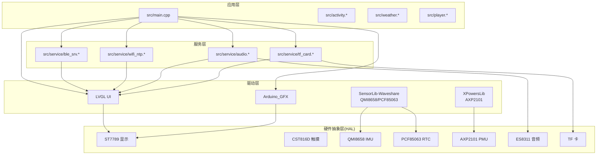
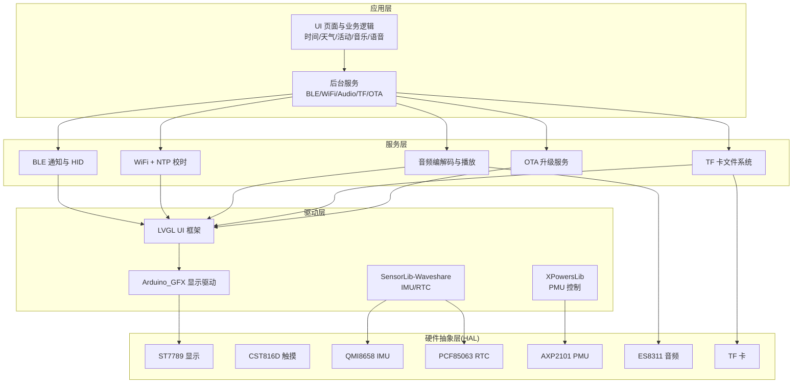
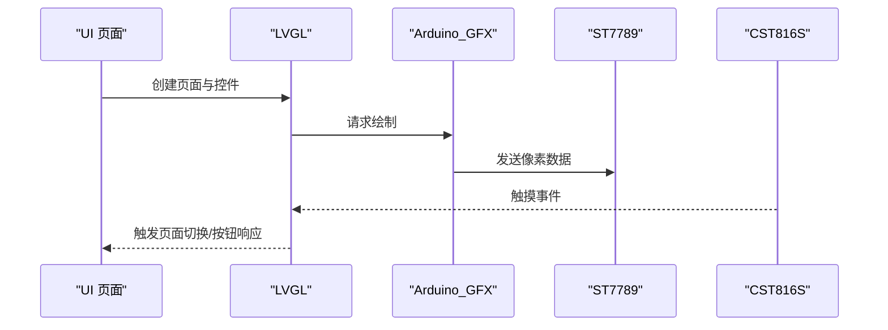
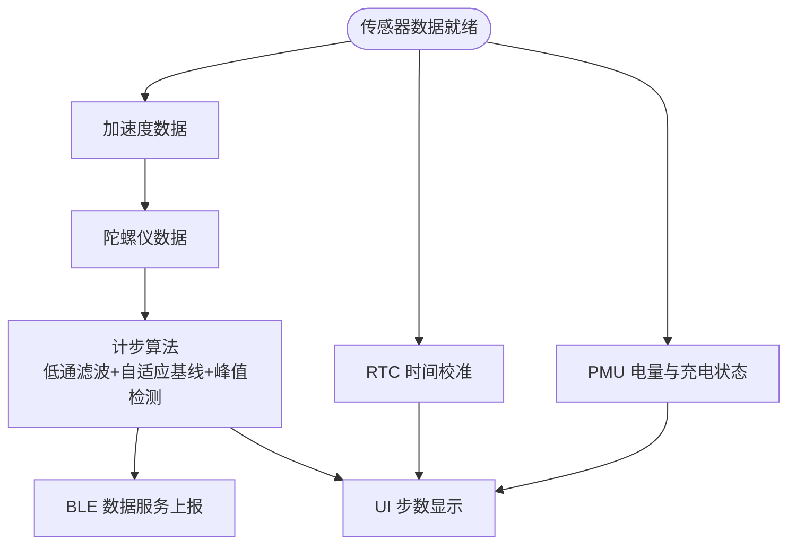
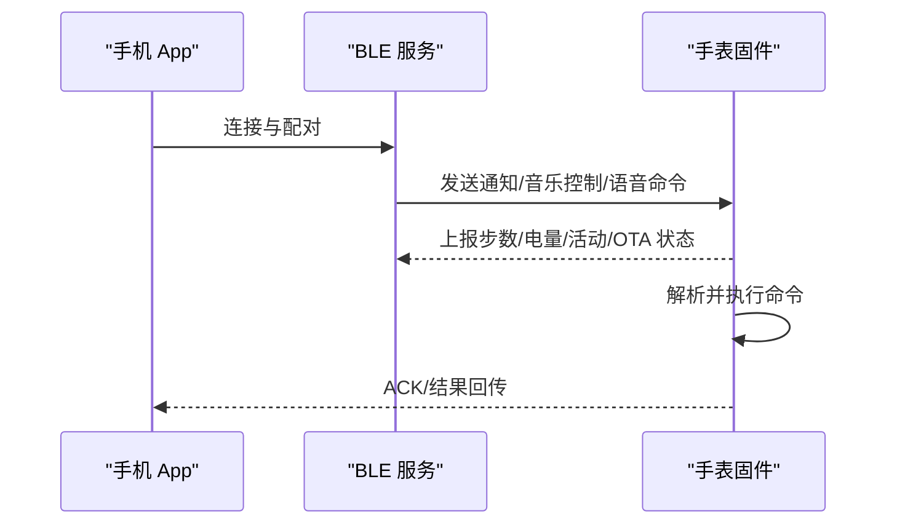
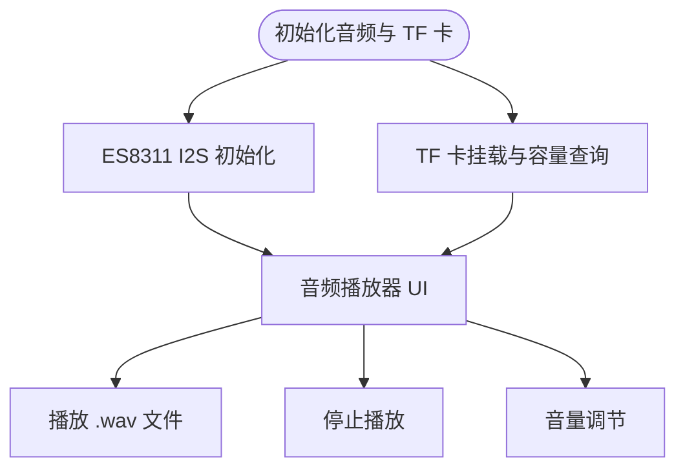
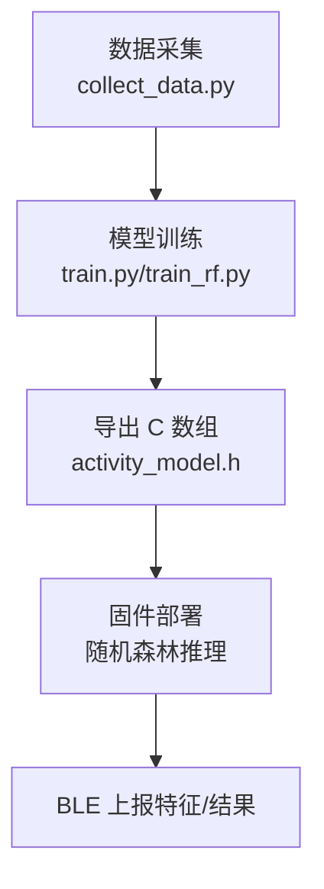
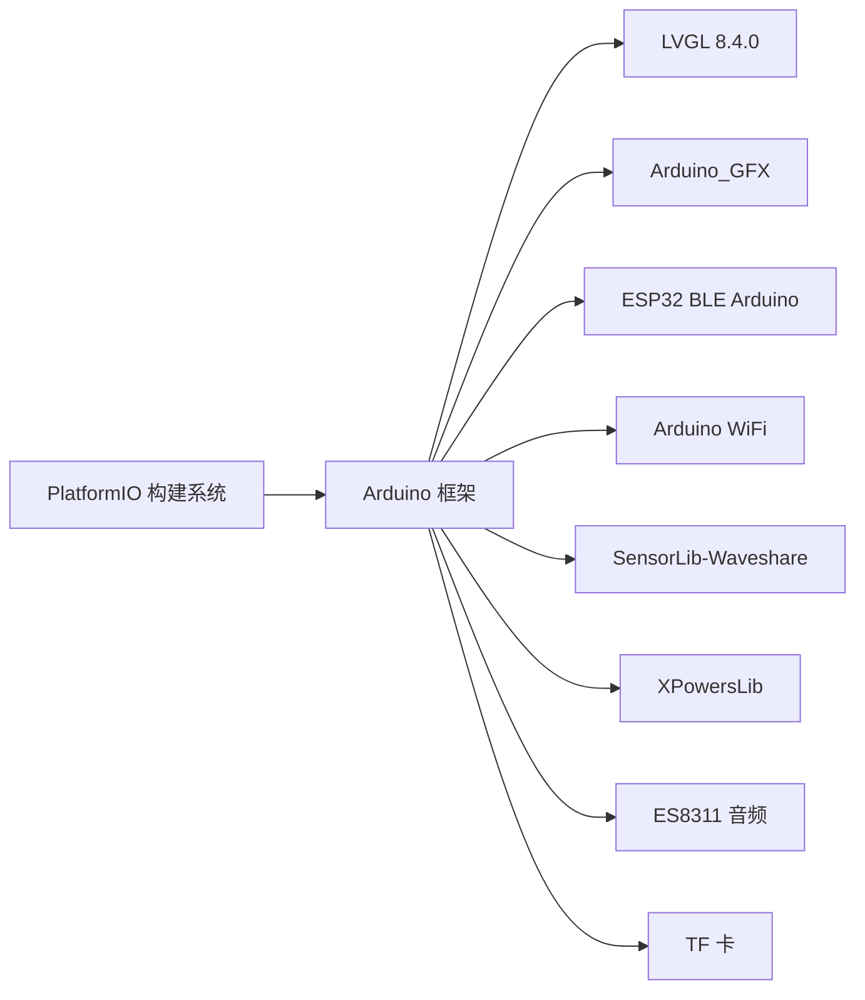

# 项目概述

<cite>
**本文档引用的文件**
- [DEVELOPMENT_PLAN.md](file://DEVELOPMENT_PLAN.md)
- [EDGE_AI_TRAINING_PLAN.md](file://EDGE_AI_TRAINING_PLAN.md)
- [platformio.ini](file://platformio.ini)
- [include/lv_conf.h](file://include/lv_conf.h)
- [include/pin_config.h](file://include/pin_config.h)
- [boards/ESP32-S3-R8-OPI.json](file://boards/ESP32-S3-R8-OPI.json)
- [src/main.cpp](file://src/main.cpp)
- [src/activity.h](file://src/activity.h)
- [src/weather.h](file://src/weather.h)
- [src/player.h](file://src/player.h)
- [src/service/ble_srv.h](file://src/service/ble_srv.h)
- [src/service/wifi_ntp.h](file://src/service/wifi_ntp.h)
- [src/service/audio.h](file://src/service/audio.h)
- [src/service/tf_card.h](file://src/service/tf_card.h)
- [webapp/package.json](file://webapp/package.json)
</cite>

## 目录
1. [项目简介](#项目简介)
2. [项目结构](#项目结构)
3. [核心组件](#核心组件)
4. [架构总览](#架构总览)
5. [详细组件分析](#详细组件分析)
6. [依赖关系分析](#依赖关系分析)
7. [性能考量](#性能考量)
8. [故障排查指南](#故障排查指南)
9. [结论](#结论)
10. [附录](#附录)

## 项目简介

SmartBracelet 是一款基于 Waveshare ESP32-S3-Touch-LCD-1.83 开发板的全功能智能手环项目。项目以“边缘 AI + 手机协同”为核心理念，结合 ESP32-S3 的高性能双核处理器与丰富的外设资源，实现健康监测、实时活动识别、多传感器融合、显示系统、无线通信与音频播放等完整功能。

项目采用分层架构设计，自下而上分为硬件抽象层（HAL）、驱动层、服务层与应用层，确保软硬件解耦与可扩展性。在技术栈方面，项目集成了 Arduino_GFX、LVGL、ESP-IDF 等关键依赖，并通过 Flutter 跨平台框架构建手机配套应用，形成手表端与手机端的分布式 AI 推理协作体系。

SmartBracelet 的差异化优势体现在：
- 硬件平台：ESP32-S3（240MHz 双核，16MB Flash，8MB OPI PSRAM），支持向量指令集加速 AI 推理
- 显示方案：ST7789 240×284 触摸屏，配合 Arduino_GFX 与 LVGL 实现流畅 UI
- AI 路线：手表端侧推理（随机森林）+ 手机端推理（ONNX/TFLite）的分布式协作
- 通信与续航：BLE 通知同步、WiFi NTP 校时、深度睡眠与自动息屏，目标续航 24h+ 使用、72h+ 待机
- 开发环境：PlatformIO + Arduino 框架 + Flutter，开源策略明确

**章节来源**
- [DEVELOPMENT_PLAN.md](file://DEVELOPMENT_PLAN.md#L50-L66)
- [DEVELOPMENT_PLAN.md](file://DEVELOPMENT_PLAN.md#L221-L261)

## 项目结构

项目采用模块化目录组织，主要包含以下层次：
- src：应用层与服务层源码，包含 UI 页面、业务逻辑与后台服务
- include：配置头文件，如 LVGL 配置与引脚映射
- lib：本地库与第三方库，如 Arduino_GFX、SensorLib-Waveshare、XPowersLib
- boards：自定义板级定义，适配 ESP32-S3-R8-OPI
- training：边缘 AI 训练管线，包含数据采集、模型训练与导出
- webapp：Flutter 手机应用，负责与手表进行 BLE 通信与数据同步

**图表来源**
- [DEVELOPMENT_PLAN.md](file://DEVELOPMENT_PLAN.md#L277-L315)
- [src/main.cpp](file://src/main.cpp#L1-L120)

**章节来源**
- [DEVELOPMENT_PLAN.md](file://DEVELOPMENT_PLAN.md#L277-L315)

## 核心组件

- 显示与输入系统
  - ST7789 240×284 LCD + Arduino_GFX + LVGL，支持多页面导航、动画与中文显示
  - CST816D 触摸控制器，I2C 接口，支持滑动/手势/点击
- 传感器与电源管理
  - QMI8658 6 轴 IMU（加速度+陀螺仪），用于计步、抬手亮屏与活动识别
  - PCF85063 RTC，支持 NTP 校时
  - AXP2101 PMU，支持电量读取、充电管理与低功耗控制
- 无线通信
  - BLE 通知服务（自定义 GATT Profile），支持 UTF-8 中文消息与双向通信
  - WiFi 自动连接 + NTP 校时，周期性开启以节省功耗
- 媒体与存储
  - ES8311 音频编解码器 + I2S，支持 WAV 播放与音量控制
  - TF 卡（SDMMC 1-bit），FAT32 文件系统，支持文件枚举与容量查询
- 边缘 AI 与训练管线
  - 端侧活动识别：随机森林（10 棵决策树，12 维统计特征），部署运行
  - 训练管线：collect_data.py → train.py/train_rf.py → C 数组导出

**章节来源**
- [DEVELOPMENT_PLAN.md](file://DEVELOPMENT_PLAN.md#L11-L46)
- [DEVELOPMENT_PLAN.md](file://DEVELOPMENT_PLAN.md#L175-L208)
- [src/activity.h](file://src/activity.h#L1-L13)
- [src/weather.h](file://src/weather.h#L1-L7)
- [src/player.h](file://src/player.h#L1-L6)
- [src/service/audio.h](file://src/service/audio.h#L1-L23)
- [src/service/tf_card.h](file://src/service/tf_card.h#L1-L9)

## 架构总览

SmartBracelet 采用分层架构，从底层硬件到上层应用逐层抽象，确保模块内聚、降低耦合，并便于扩展与维护。

**图表来源**
- [DEVELOPMENT_PLAN.md](file://DEVELOPMENT_PLAN.md#L221-L261)
- [src/main.cpp](file://src/main.cpp#L1-L120)

**章节来源**
- [DEVELOPMENT_PLAN.md](file://DEVELOPMENT_PLAN.md#L221-L261)

## 详细组件分析

### 显示与输入系统（ST7789 + Arduino_GFX + LVGL）

- 显示驱动：基于 Arduino_GFX 的 ST7789 驱动，偏移设置为 (0,20,0,0)，RGB565 SWAP=0，配合 LVGL 8.4.0 实现高帧率渲染
- 触控驱动：CST816S 库兼容 CST816D，I2C 引脚 15/14，支持滑动/手势/点击，与 LVGL 输入端口集成
- UI 页面：数字表盘、模拟表盘、传感器页、通知页、秒表/倒计时、天气、活动识别、音乐播放器、语音聊天等共 10 页
- 低功耗策略：自动息屏 10s，触摸/抬腕唤醒，深度睡眠 30s + 触摸/RTC 60s 唤醒

**图表来源**
- [include/lv_conf.h](file://include/lv_conf.h#L1-L114)
- [include/pin_config.h](file://include/pin_config.h#L1-L41)
- [src/main.cpp](file://src/main.cpp#L406-L419)

**章节来源**
- [include/lv_conf.h](file://include/lv_conf.h#L1-L114)
- [include/pin_config.h](file://include/pin_config.h#L1-L41)
- [src/main.cpp](file://src/main.cpp#L406-L419)

### 传感器与电源管理（QMI8658/PCF85063/AXP2101）

- IMU（QMI8658）：加速度计 4G、陀螺仪 64DPS，125Hz/112.1Hz 采样率，低通滤波与自适应基线峰值检测实现计步
- RTC（PCF85063）：I2C 接口，支持时间读写与 NTP 校时
- PMU（AXP2101）：电量读取、充电管理、电源轨配置、功耗优化与深睡控制

**图表来源**
- [src/main.cpp](file://src/main.cpp#L516-L547)
- [src/main.cpp](file://src/main.cpp#L615-L722)

**章节来源**
- [src/main.cpp](file://src/main.cpp#L516-L547)
- [src/main.cpp](file://src/main.cpp#L615-L722)

### 无线通信（BLE 通知与 HID、WiFi NTP）

- BLE 通知服务：自定义 GATT Profile，支持 UTF-8 中文消息、双向通信、勿扰模式、OTA 状态上报
- BLE HID：音乐控制（播放/暂停/切歌/音量），通过 HID 协议与手机端联动
- WiFi：自动连接（硬编码 SSID/PASS）、NTP 校时、周期性开启以降低功耗

**图表来源**
- [src/service/ble_srv.h](file://src/service/ble_srv.h#L1-L50)
- [src/service/wifi_ntp.h](file://src/service/wifi_ntp.h#L1-L26)
- [src/main.cpp](file://src/main.cpp#L718-L721)

**章节来源**
- [src/service/ble_srv.h](file://src/service/ble_srv.h#L1-L50)
- [src/service/wifi_ntp.h](file://src/service/wifi_ntp.h#L1-L26)
- [src/main.cpp](file://src/main.cpp#L718-L721)

### 媒体与存储（ES8311 音频、TF 卡）

- ES8311 音频编解码器：I2S 主控 TX，PCA9557 PA_EN，支持正弦波与 WAV 播放、音量控制
- TF 卡：SDMMC 1-bit，FAT32 文件系统，支持文件枚举与容量查询，用于音频播放器 UI

**图表来源**
- [src/service/audio.h](file://src/service/audio.h#L1-L23)
- [src/service/tf_card.h](file://src/service/tf_card.h#L1-L9)
- [src/main.cpp](file://src/main.cpp#L647-L648)

**章节来源**
- [src/service/audio.h](file://src/service/audio.h#L1-L23)
- [src/service/tf_card.h](file://src/service/tf_card.h#L1-L9)
- [src/main.cpp](file://src/main.cpp#L647-L648)

### 边缘 AI 与训练管线（随机森林活动识别）

- 端侧推理：随机森林（10 棵决策树，12 维统计特征），代码体积约 500 字节，推理时间 <1ms
- 训练管线：collect_data.py（串口采集 IMU 数据）→ train.py/train_rf.py（模型训练与导出）→ C 数组嵌入固件
- 分布式 AI：手表端轻量模型 + 手机端大模型协作，BLE 交换推理结果

**图表来源**
- [EDGE_AI_TRAINING_PLAN.md](file://EDGE_AI_TRAINING_PLAN.md#L54-L104)
- [EDGE_AI_TRAINING_PLAN.md](file://EDGE_AI_TRAINING_PLAN.md#L132-L194)
- [src/activity.h](file://src/activity.h#L1-L13)

**章节来源**
- [EDGE_AI_TRAINING_PLAN.md](file://EDGE_AI_TRAINING_PLAN.md#L54-L104)
- [EDGE_AI_TRAINING_PLAN.md](file://EDGE_AI_TRAINING_PLAN.md#L132-L194)
- [src/activity.h](file://src/activity.h#L1-L13)

## 依赖关系分析

项目依赖关系清晰，围绕 PlatformIO 构建系统与 Arduino 框架展开，关键依赖如下：

- 平台与框架：espressif32@6.9.0 + Arduino 框架
- UI 框架：LVGL 8.4.0（配置于 include/lv_conf.h）
- 显示驱动：Arduino_GFX（ST7789）
- 触控驱动：CST816S（兼容 CST816D）
- 传感器驱动：SensorLib-Waveshare（PCF85063/ QMI8658）
- 电源管理：XPowersLib（AXP2101）
- 通信：ESP32 BLE Arduino（Bluedroid）+ Arduino WiFi
- AI 推理：随机森林（已部署）+ TFLite Micro（可选）

**图表来源**
- [platformio.ini](file://platformio.ini#L14-L41)
- [include/lv_conf.h](file://include/lv_conf.h#L1-L114)
- [DEVELOPMENT_PLAN.md](file://DEVELOPMENT_PLAN.md#L263-L276)

**章节来源**
- [platformio.ini](file://platformio.ini#L14-L41)
- [include/lv_conf.h](file://include/lv_conf.h#L1-L114)
- [DEVELOPMENT_PLAN.md](file://DEVELOPMENT_PLAN.md#L263-L276)

## 性能考量

- 内存预算与优化
  - RAM：当前 149KB/320KB（45.6%），LVGL heap 64KB，BLE/WiFi 栈约 30KB，剩余约 170KB
  - PSRAM：不可用（BOARD_HAS_PSRAM 注释掉），Tensor Arena 原定 100KB，现降至 60KB
  - LVGL 配置：颜色深度 16bit，DRAW_COMPLEX=1，字体启用 UTF-8 中文
- 功耗策略
  - 活跃：CPU 240MHz + 屏幕亮，约 80mA
  - 息屏：CPU 240MHz，屏幕灭，约 30mA
  - 深睡：仅 RTC + ULP，约 2.5mA
  - 目标：正常使用续航 24h+，待机 72h+
- 无线与显示
  - WiFi 采用周期性开启（每 10 分钟），避免持续功耗
  - LVGL 刷新周期 30ms，触摸读周期 30ms，兼顾流畅与功耗

**章节来源**
- [EDGE_AI_TRAINING_PLAN.md](file://EDGE_AI_TRAINING_PLAN.md#L41-L51)
- [include/lv_conf.h](file://include/lv_conf.h#L18-L46)
- [DEVELOPMENT_PLAN.md](file://DEVELOPMENT_PLAN.md#L209-L218)

## 故障排查指南

常见问题与解决方案：
- 白屏/启动循环：检查 USBSerial 重复定义与全局 new 崩溃，确认上传后手动冷启动
- USB 插拔后 flash 损坏：全片擦除 + esptool 手动三段式烧录
- LVGL 集成：显示缓冲区、颜色字节序（SWAP=0）、配置路径正确
- 触摸迁移：从引脚 19/20 迁移到 15/14，CST816S 回退
- Boot Loop 修复：Arduino_DriveBus → CST816S 回退、精简依赖
- 传感器集成：RTC/IMU/PMU 全通，LVGL 多页面表盘
- BLE 迁移：NimBLE → ESP32 BLE Arduino（Bluedroid），简化集成
- 抬手亮屏：IMU 重力角度抬腕检测、息屏/深睡状态机
- 顶部花屏：ST7789 越界像素清除、ADC 原始读取、USB 跳过深睡
- ES8311 音频：编解码器时钟配置、功放使能、DMA 缓冲

**章节来源**
- [DEVELOPMENT_PLAN.md](file://DEVELOPMENT_PLAN.md#L528-L558)

## 结论

SmartBracelet 项目以 ESP32-S3 为硬件核心，结合 Arduino_GFX、LVGL、SensorLib-Waveshare、XPowersLib 等关键依赖，构建了从显示输入、传感器与电源管理、无线通信到媒体与存储的完整智能手环系统。项目采用“手表端轻量推理 + 手机端大模型”的分布式 AI 架构，既满足日常佩戴的续航与交互需求，又为未来的 AI 增强与语音助手预留扩展空间。开发历程清晰，当前阶段已完成基础平台、通信与续航、增强功能与边缘 AI 的核心能力，下一步可推进 OTA 升级与手机 App 开发，实现手表与手机的深度协同。

## 附录

- 开发环境与工具链
  - PlatformIO + Arduino 框架，Python 3.12，Flutter 3.x（待安装）
  - 模型训练：PyTorch 2.11 + CUDA 128、scikit-learn 1.8、Transformers 5.8
  - 服务配置：WiFi SSID（硬编码）、NTP 服务器、天气 API、BLE 名称
- 烧录方式建议：使用 esptool.py 直接烧录，波特率 115200，Flash 模式 QIO
- 手机 App：Flutter 跨平台，依赖 @capacitor-community/bluetooth-le，BLE 通信与数据看板

**章节来源**
- [DEVELOPMENT_PLAN.md](file://DEVELOPMENT_PLAN.md#L451-L504)
- [webapp/package.json](file://webapp/package.json#L15-L21)